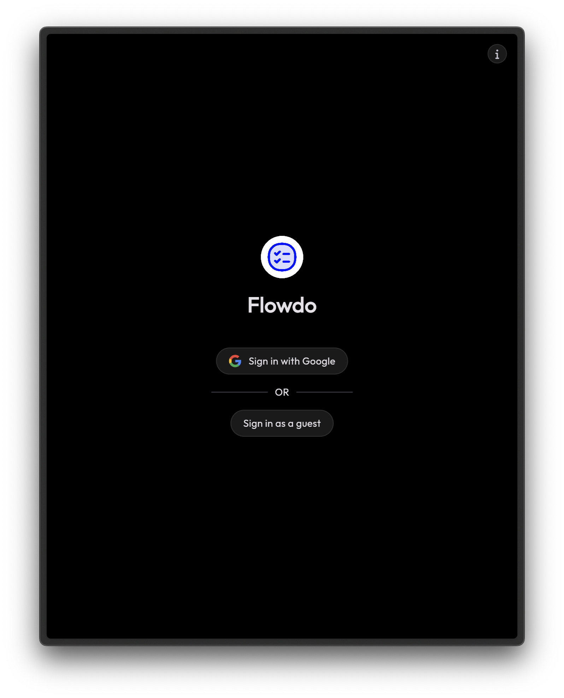
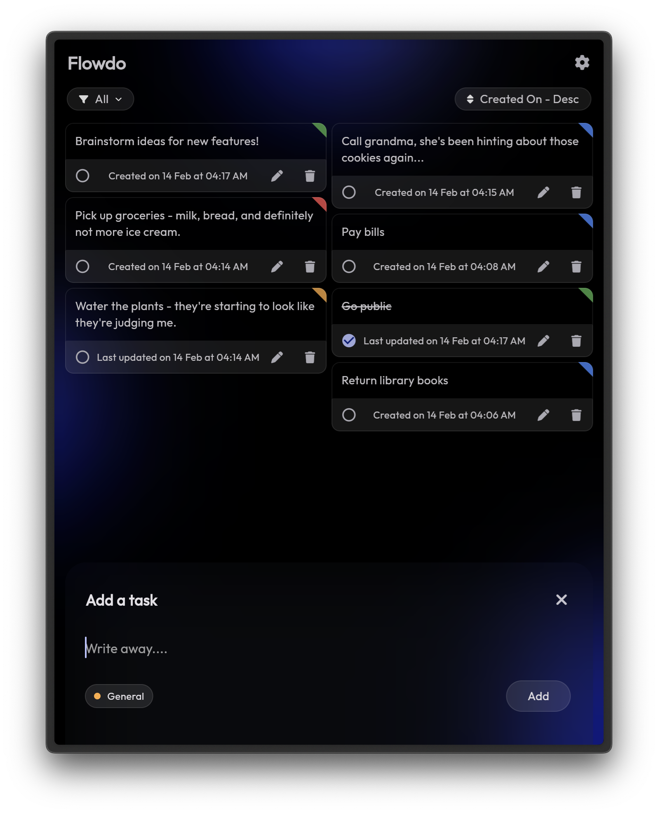
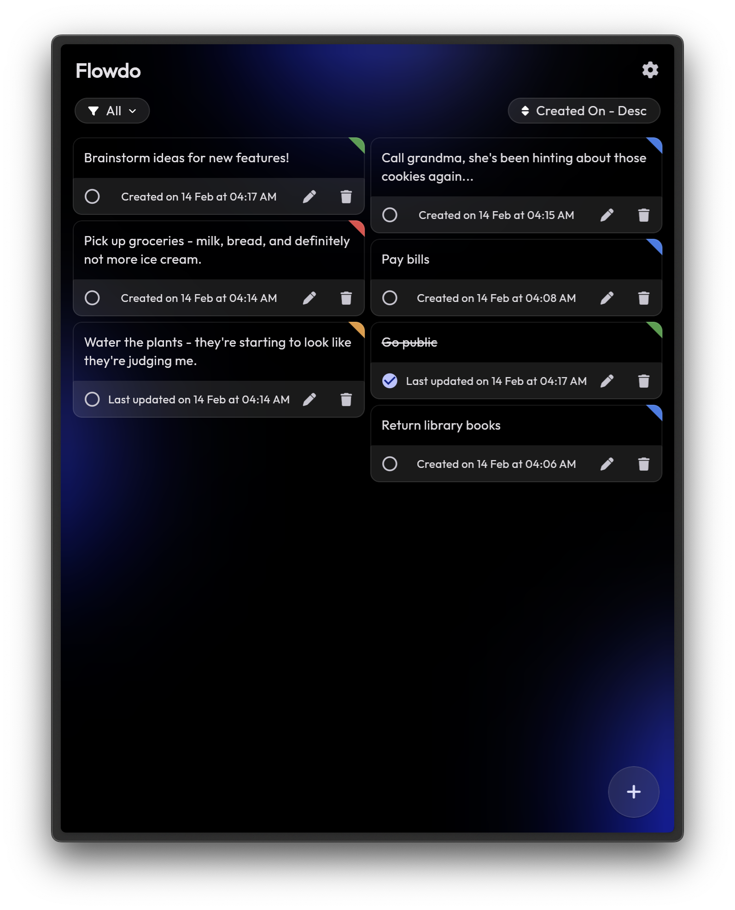
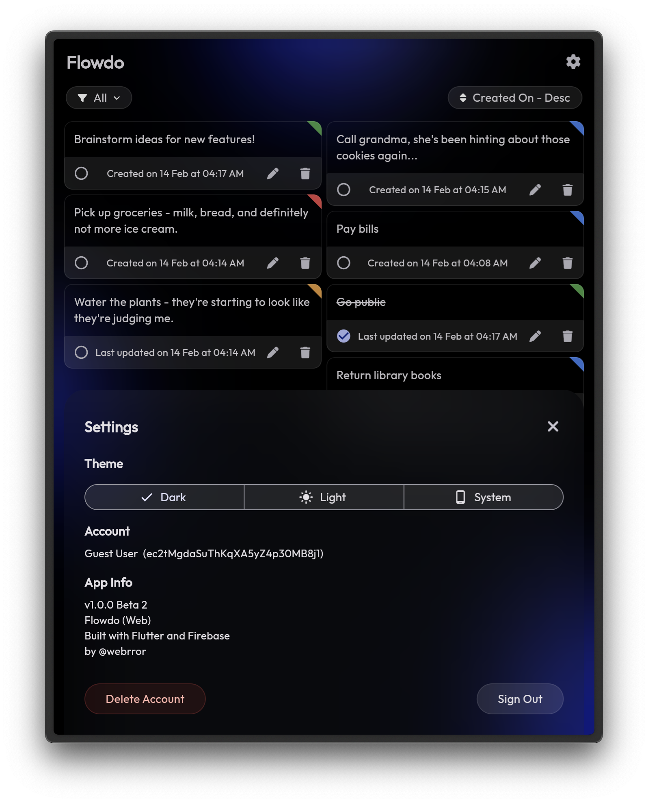

# Flowdo

### A Todo app built with Flutter and Firebase

### Features
- **Add, Edit, Delete**: Seamlessly manage your tasks with intuitive actions.
- **View All To-Dos**: See a comprehensive overview of your tasks within all categories.
- **Categorization**: Organize your tasks effectively with four pre-defined categories: General, Important, Work, and Personal.
- **Mark as Complete**: Check off tasks as you finish them for a satisfying sense of accomplishment.
- **Theme Options**: Choose between light and dark themes to match your preferences.
- **Google Sign-In**: Connect with your Google account for a secure and convenient experience. Access your tasks and updates across all your devices seamlessly.
- **Quick Add**: Add new tasks directly from your home screen on Android and iOS with Quick Actions feature. Long press on app icon and add away.

### Screens



### Working
https://github.com/webrror/flowdo/assets/65507007/d59a57d6-70c1-47d0-b936-c7398d976f94

### Development Stack
- <a href="https://flutter.dev/">**Flutter**</a>
- <a href="https://firebase.google.com/">**Firebase**</a>

<!-- 
## Commands

- Build APK for `android-arm` platform
  
  ```
  flutter build apk --split-per-abi --target-platform android-arm 
  ```

- Build APK for all platforms

  ```
  flutter build apk --split-per-abi
  ``` -->

### Winner of <a href="https://www.zeepalm.com/flutter-challenge">Flutter Challenge by ZEEPALM</a>
